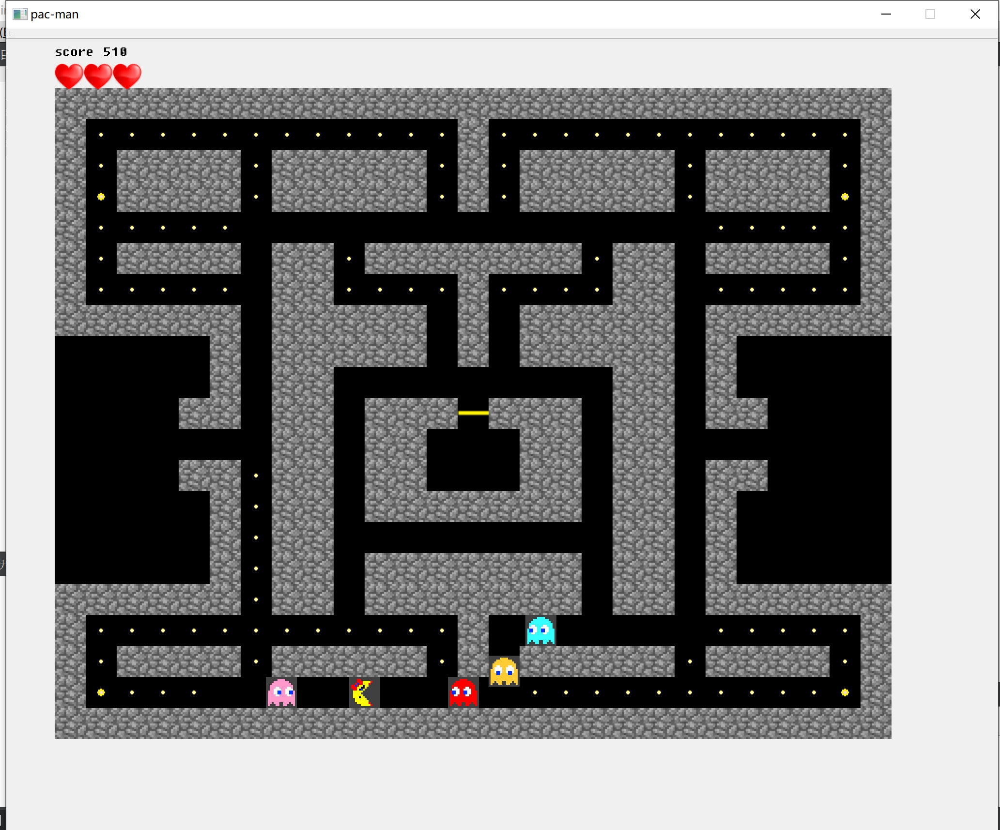

一个简单的基于QT实现的Pac-Man小游戏

# 项目背景

游戏简介

《吃豆人(Pac-Man)》是一款最早由1980年日本Namco公司推出的街机游戏。

玩家操纵的角色（吃豆人）处于迷宫内，可以往某个方向前进，而玩家可以控制角色的方向。当角色与地图中的黄点发生碰撞就能将它吃掉，游戏的目标是将迷宫内的所有的黄点吃掉。游戏的中央有四个幽灵，会以各自的方式追逐玩家。当吃豆人被幽灵追上，则损失一点生命值并重新开始吃豆。地图的四周有四个闪烁的大黄点，一旦角色吃到大黄点即可开启疯狂状态，此时角色碰到幽灵则会使得幽灵逃回中央。

# 项目内容

我们使用的版本是Qt5.6.1，使用的工具是Qmake，运行环境需要将mingw文件夹加入环境变量。

我们利用C++和Qt，仿制了一个简单的吃豆人游戏。

玩家可以使用 WSAD 或 上下左右 控制吃豆人的移动，使用 Space 暂停游戏，在游戏结束（胜利或失败）后可以按  Enter 键重新开始 新的一局游戏。


# 项目架构

整个项目包括 5 个头文件，8 个C++的源文件，1个界面文件，以及地图资源，音乐资源和若干图片资源。

头文件：`base.h`,`game.h`,`ghost.h`,`mainwindow.h`,`pacman.h`

源文件：`base.cpp`, `game.cpp`, `ghost.cpp`, `ghost_strategies.cpp` ,`main.cpp`, `mainwindow.cpp`, `pacman.cpp`

界面文件：`mainwindow.ui` ，界面文件基本为空，控件和对象基本都在代码中生成。

地图资源：位于 `/map` 目录下，以 `txt` 文本的形式保存了地图的样式。

图片资源：位于 `/images` 目录下，下包括 `/ghost` , `/map_objects` , `/pacman` 等子目录，内有 `png` 图片，图片主要大小为 32*32。

我们还加入了音乐等方面的设计，使玩家有一个良好的游戏体验。

## 主要设想

使用 `Qtimer` 实现幽灵和吃豆人的移动，并在移动后进行碰撞判定

对每个幽灵绑定一个策略，用于决策追踪方法。

当幽灵或吃豆人处于地图的整格转角处时，通过玩家已经按下的键盘和当前的游戏局面对下一步的方向进行决策。

利用 `QGraphicsPixmapItem` 和 `QGraphicsScene` 实现图片的显示和移动。

基础参数

我们在 `base.h` 中命名空间 BaseH 中声明了一些基本参数，并在 `base.cpp` 中定义和赋予了初值。

```c++
namespace BaseH{
    enum mapstate{Space=0,Wall=1,Food=2,Medicine=3,Door=4,Portal=5};
    enum pacmanstate{Normal=0,Panic=1};
    enum ghoststate{Incave=0,Outingcave=1,Outcave=2,Backingcave=3};
    enum dirstate{Left=0,Right=1,Up=2,Down=3,Stop=4};
    enum stat{Start=0,Over=1,Pause=2};
    extern const int deltax[5];
    extern const int deltay[5];
    extern int Width,Height,ObjectWidth;
    extern int startX,startY;
    extern int map[35][35];
    extern const int INTERVAL_ghost,INTERVAL_pacman, INTERVAL_pacman_animation, INTERVAL_ghost_animation;
    extern int doorx,doory;
    extern const int INTERVAL_flash;
    extern const int score_food,score_medicine;
    //extern QPixmap blue_ghost,orange_ghost,pink_ghost,red_ghost;
    //extern QPixmap blankpng,wallpng,foodpng,medicinepng,gatepng;
}
```
我们使用 Width * Height 的 int 数组来保存地图的状态，0表示空位，1表示墙，2表示小黄点，3表示闪烁的大黄点（药），4表示阻挡幽灵的门，5为传送门，用于将吃豆人从左侧传送到右侧。
吃豆人的状态有两种，正常状态，或者是吃了大黄点（嗑药）的疯狂状态。

幽灵的状态有四种可能，在笼子中，正在出笼子，已经出了笼子，返回笼子的过程。

游戏的状态有三种可能，正常进行，游戏结束，游戏暂停

deltax=[-1,1,0,0,0]和deltay=[0,0,-1,1,0] 是为了方便吃豆人和幽灵的移动的实现而定义的常量数组。

startX和startY表示整个地图左上角位于界面的位置。

INTERVAL_ghost表示用于控制幽灵移动的Qtimer的间隔时间，也即幽灵的移动速度

INTERVAL_pacman表示用于控制吃豆人移动的Qtimer的间隔时间，也即吃豆人的移动速度

INTERVAL_pacman_animation, INTERVAL_ghost_animation 是为了实现吃豆人和幽灵移动时候的动画播放。

INTERVAL_flash 是为了实现大黄球（药）的闪烁

我们在项目开始的时候大致设置了这些参数，以方便后续的开发。

## 类的设计

我们总共实现了如下的类 `MainWindow`, `Game`  , `Base`, `Pacman` , `Ghost` 。其中 `Pacman` 和 `Ghost` 继承自 `Base` ，具体设计如下:

### MainWindow：

用于创建窗口，显示窗口中的得分，游戏胜负状况，剩余血量。

在构造函数中生成有一个 `Game` 类的实例 game。

接受键盘输入信号，并传递给 game。

##### 数据显示模块

窗体内对象的显示为一些 `QLabel` 的新建，而这些对象的通过一个 `Qtimer` 实时更新，具体显示内容和样式与当前游戏状态，game内的参数有关。

### Game

游戏类，主要成员对象为几乎所有的 `Qtimer`，一个 `Pacman` 类的实例 pacman，四个 `Ghost` 类的实例 ghost0, ... ghost3，可视化地图对象的实例 uimap。

在这个类里，我们实现了几乎所有的**可视化**。

在这个类里，我们还给出一些对 pacman 和 ghost 操作的句柄。

##### 游戏的初始化

在这个类里，我们实现了游戏的初始化。

我们从 txt 文本中获取地图信息，一方面保存在 map 数组中，另一方面用 以`Base*` 为类型的 uimap数组将地图信息以图片地形式呈现在界面上。

同时，一依据地图信息，新建幽灵和吃豆人的对象，并对幽灵绑定行动策略。

##### 游戏的开始暂停，结束与重启

在这个类里，我们实现了游戏的开始，暂停，结束与重启

开始函数主要是对pacman以及ghost的状态进行初始化，重启则主要是重新对地图进行构建。

##### 动画模块

我们使用 pacman_animation_timer，ghost_animation_timer 对 pacman 和 ghost 进行动画显示，所需要的相应图片事先在对应实例名为 animations 的 Qvector 中保存，通过不断播放图片以实现动画的效果。

##### 吃豆模块

当吃豆人到达整点位置时，我们获取地图在当前格点的元素，并根据元素是小黄点（食物）或者是大黄点（药）对游戏，吃豆人，幽灵的状态进行改变。包括改变地图信息，对界面进行改变。

### Base

作为 `Pacman` 和 `Ghost` 的基类，存储有游戏物件的基本信息，实现了获取所在地图位置的坐标，判断移动是否合法，等基本功能。且base是 QGraphicsScene的继承类，可以通过设置其图片以及位置来达到可视化的目标。

### Pacman

在这个类里，我们实现了吃豆人的相关函数，包括移动，碰撞判定

##### 移动模块

在这个模块里，我们实现了吃豆人的移动。

首先我们获取了吃豆人的位置，并根据当前移动的方向，重新设置吃豆人的坐标，例如如果吃豆人所处的位置是传送门，那么将吃豆人传送到另一侧。

其次，当吃豆人恰好处于地图的整格时，即可能发生方向的改变，我们在程序中依据先前按下的键盘，当前的方向，以及地图的信息和所处的坐标，得出下一个移动方向的信息。当处于整格时，也会进行其它方面的一些信息的同步与修改。

### Ghost

在这个类里，我们实现了幽灵的相关函数，包括四种状态下的移动，这里利用到了 `ghost_strategies.cpp` 内的策略函数。

##### 移动模块

幽灵的移动方法实现与吃豆人移动方法实现类似，但根据幽灵所处的不同状态，拥有不同的移动策略。

当幽灵处于Outcaving状态时，即幽灵经过一定的静默状态后要出笼子的过程，我们通过设计让幽灵在走到门外，并禁止其再次通过门。

当幽灵处于Incave状态时，停止运动

当幽灵处于Backingcave状态时，通过最短路径返回初始点。

当幽灵处于Outcave状态时，通过调用相应的策略，追踪或者躲避Pacman。

### 其它模块设计与实现

##### 策略模块

在 `ghost_strategies.cpp` ，我们实现了四个幽灵的行动策略，其中幽灵行动的方法参考 [这里](https://www.mentalfloss.com/article/90874/your-pac-man-game-learning-different-strategies-each-ghost) 。

一个chasing函数获取ghost 和 pacman 的信息，返回一个函数 F，函数 F 可以被调用，每次被调用则返回依据当前地图局面确定的幽灵下一步应该行走的方向。

```c++
std::function<BaseH::dirstate()> chasing(Ghost *ghost,Pacman *pacman){
  return [=](){return (one of the dirstate);};
};
```

# 项目总结与反思

我们对该项目的开发尽然有序，在开发过程中广泛交流讨论，使得我们的开发并没有出现太多的不协调的障碍。

但由于一些原因，我们只实现了较为基础的部分，最初一些的好的设想没来得及加入。

在项目开发过程中熟悉掌握了 Qt 和 Git 的用法，了解了多人协同开发的简单形式，也初步了解了包括链接。多文件编译在内的知识，受益匪浅。

特别感谢 吴槿昭助教（Scape哥哥）在项目开发中不厌其烦的指导和帮助。


小组分工：

陈奇之：主要是移动等模块的代码编写

黄骏齐：主要是可视化的实现，数据的读取与加载，前后端交互

张家梁：主要是面向用户的设计，包括界面设计，资料收集，美工等
